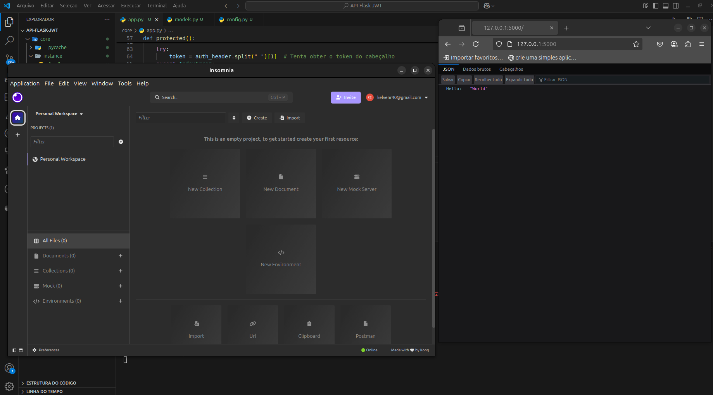
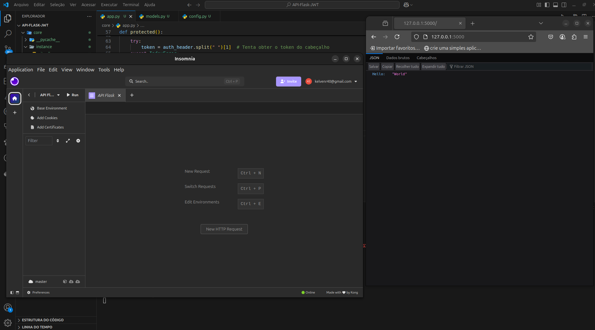
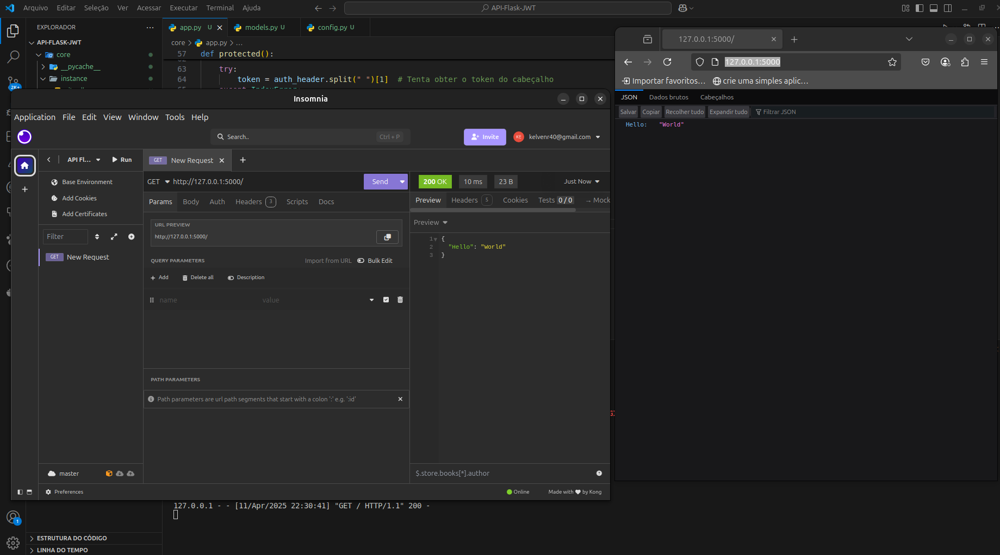
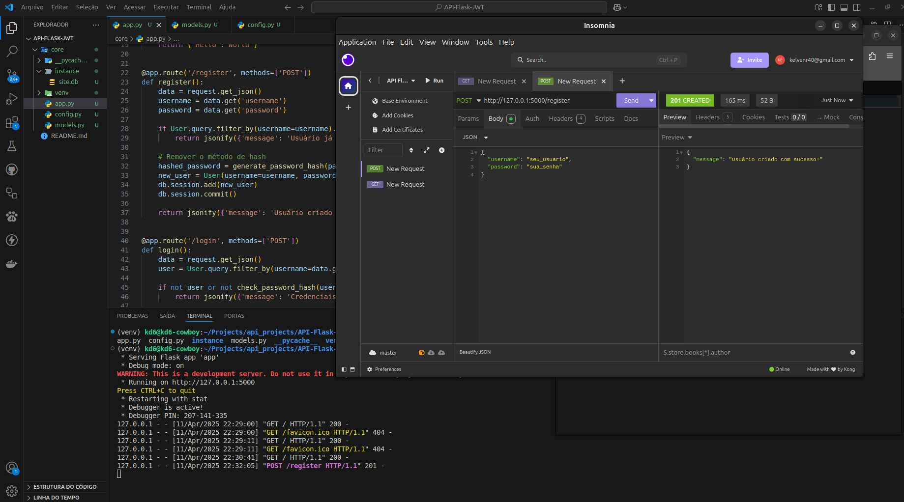
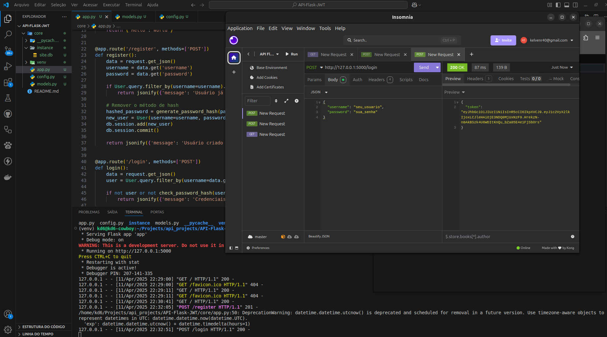
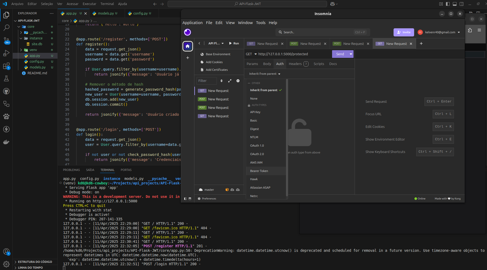
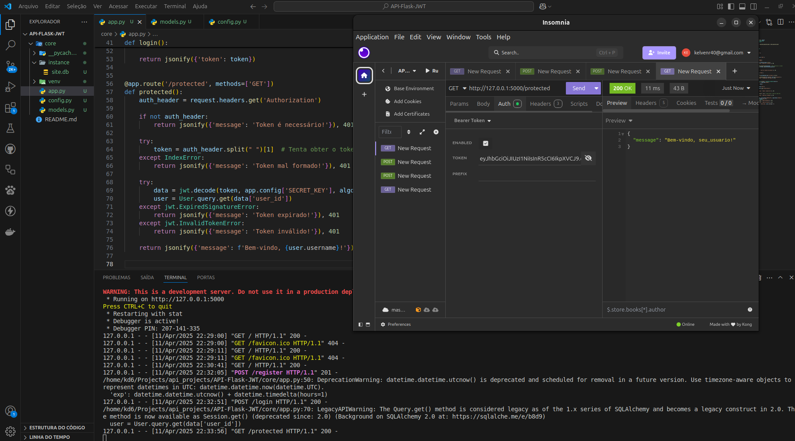

# API Flask com Autenticação JWT
 
 
 


Esta é uma API simples construída com Flask que implementa autenticação usando JSON Web Tokens (JWT). A API permite o registro de usuários, login e acesso a rotas protegidas.

## Funcionalidades.

- Registro de novos usuários
- Login de usuários existentes
- Geração de tokens JWT para autenticação
- Acesso a rotas protegidas com autenticação JWT

## Tecnologias Utilizadas.

- Python 3.x
- Flask
- Flask-SQLAlchemy
- Flask-Migrate
- PyJWT
- SQLite (banco de dados)

## Pré-requisitos.

Antes de começar, você precisará ter o Python e o pip instalados em sua máquina. Você pode baixar o Python [aqui](https://www.python.org/downloads/).

## Instalação:

### 1. Clone o repositório:

   ```bash
   git clone https://github.com/Rodrigo-Kelven/API-Flask-JWT.git
   cd API-Flask-JWT
   ```
### 2. Instale as dependencias:
   ```bash
   pip install -r requirements.txt
   ```
### 3. Rode a API:
   ```bash
   python app.py --reload
   ```

# Usando Insomnia
## Criando uma coleção para guardar as url's.


## Cadastrando as url's.


## Testando a primeira rota.


## Criando usuário.


## Pegando token de login.


## Passando o token no lugar correto.


## Acessando a rota protegida, so é possivel acessar passando o token de login.


## Autores
- [@Rodrigo_Kelven](https://github.com/Rodrigo-Kelven)

## Colaboradores
- [@Tiago-Dev0708](https://github.com/Tiago-Dev0708)

